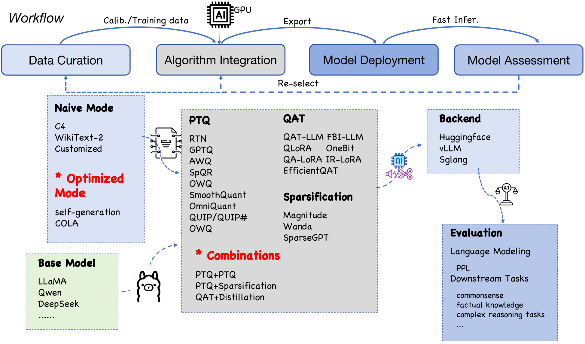

# COSQuant




We introduce a versatile quantization toolkit COSQuant that integrates a diverse array of quantization techniques and supports the flexible combination of multiple model compression strategies.


## Table of Contents

- [COSQuant](#cosquant)
  - [Table of Contents](#table-of-contents)
  - [Latest News](#latest-news)
  - [Introduction](#introduction)
  - [Supported Model List](#supported-model-list)
  - [Installation](#installation)
    - [Prerequisites](#prerequisites)
    - [Install from Source](#install-from-source)
  - [Usage](#usage)
    - [Quick Start](#quick-start)
    - [Quantization](#quantization)
    - [Evaluation](#evaluation)
    - [Deployment](#deployment)
  - [Cite](#cite)


## Latest News

- Jun 20, 2026: Add vLLM and SGLang support!
- Jan 1, 2026: We have introduced sparsification methods and now support combined compression techniques that integrate PTQ and sparsification.
- Nov 1, 2025: We now fully support quantization for the Qwen and DeepSeek
- August 1, 2025: We have open-sourced our COSQuant.


## Introduction
We introduces COSQuant, a versatile and modular quantization toolkit designed to facilitate the development of high-performance compressed models. Unlike existing alternatives, COSQuant integrates a diverse array of techniques, including Post-Training Quantization (PTQ), Quantization-Aware Training (QAT), and synergistic combinations with other compression strategies such as sparsification and knowledge distillation. Besides the algorithmic level, COSQuant enhances model performance at the data level, notably by incorporating advanced calibration data curation methods like COLA. Our toolkit enables developers to rapidly construct, evaluate, and deploy customized quantized models across mainstream foundational families like LLaMA and Qwen. 

## Supported Model List

### PTQ
- [x] AWQ
- [x] GPTQ
- [x] SmoothQuant
- [x] OmniQuant
- [x] QuIP/QUIP#
- [x] OWQ
- [x] SpQR
- [x] BiLLM
- [x] RTN


### QAT
- [x] EFFICIENTQAT 
- [x] QAT-LLM 
- [x] QLoRA
- [x] QA-LoRA
- [x] IR-QLoRA
- [x] FBI-LLM
- [x] OneBit

### PTQ + PTQ
  - [x] GPTQ + AWQ
  - [x] SmoothQuant + GPTQ

### PTQ + Sparsification
  - [x] PTQ + Naive(Magnitude) 
  - [x] PTQ + Wanda
  - [x] PTQ + SparseGPT

###  Supports for various base model, including:
    - LLaMA
    - Qwen 
    - deepseek


## Installation

### Prerequisites

- **Python**: Python 3.7 or higher must be installed on your system. 

- **Libraries**: Ensure that all necessary libraries are installed. These libraries are listed in the `requirements.txt` file. 

### Install from Source

1. Clone the repository:

    ```bash
    git clone https://github.com/Cfish808/LLM-Compression-Tool.git
    ```

2. Create and activate a virtual environment (optional but recommended):

    ```bash
    conda create -n {env_name} python=3.10
    conda activate {env_name}
    ```

3. Use pip to install packages from requirements.
   ```
   pip install -r requirements.txt
   ```

## Usage
### Quick Start
```
python main.py --config config/llama_gptq.yml
```

### Quantization
Below is an example of how to quantize model on various datasets. 
```
base_model:
    type: Llama
    path: /netcache/huggingface/llama2_7b/
    torch_dtype: torch.float16
    tokenizer_mode: fast
    device_map: auto
quant:
    method: gptq
    skip_layers: [ lm_head ]
    seqlen: 2048
    device: cuda
    weight:
      wbit: 3
      abit: 16
      offload: cpu
      block_sequential: True
      layer_sequential: True
      w_qtype: per_group
      groupsize: 128
      blocksize: 128
      percdamp: 0.01
      actorder: False
    special:
      actorder: True
      static_groups: False
      percdamp: 0.01
      blocksize: 128
      true_sequential: True
    data:
      name: c4
      nsamples: 128
      seqlen: 2048
      download: False
      path: /netcache/huggingface/c4_local/c4-train.00000-of-01024.json.gz
      batch_size: 32
      split: train
      seed: 42

save: /home/yejinyu/llama2_7b/output/llama27b_miom_2
```
*Note that all path-related parameters within the configuration files must be updated to match the user's local environment.
### Evaluation 
Below is an example of how to evaluate a quantized model on various datasets. 
```
eval:
  device: cuda
  tasks: [
    {
      task: acc,
      datasets: [winogrande, arc_easy, arc_challenge, piqa, mmlu, openbookqa, mathqa],
      batch_size: auto,
      num_fewshot: 2
    },
    {
      task: ppl,
      datasets: [wikitext2, c4],
      download: True,
      seqlen: 2048,
      nsamples: all
    }
  ]
```

### Deployment
Below is an example of model deployment. 
```
deployment:
  backend: vllm
```


## Cite
If you found this work useful, please consider citing our work:

《COSQuant: A Quantization Toolkit Empowered by Data Optimization and Synergistic Compression》
